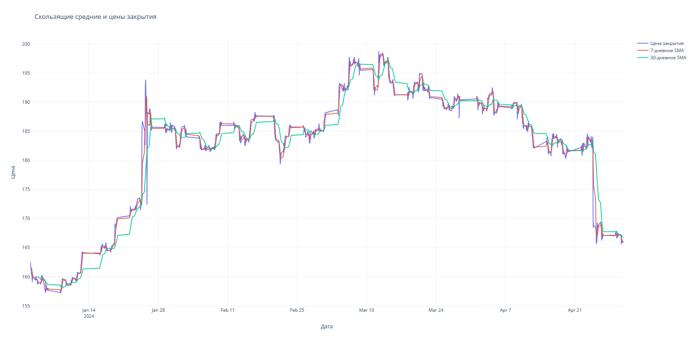
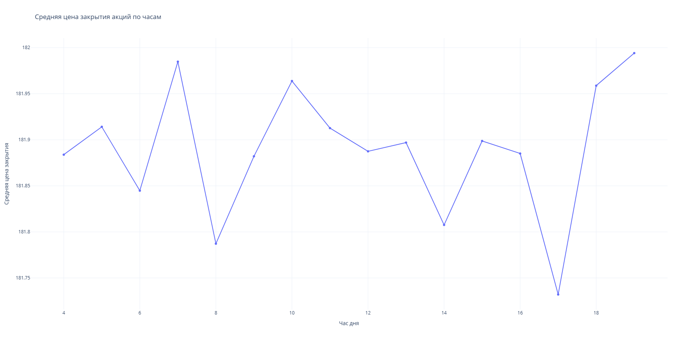
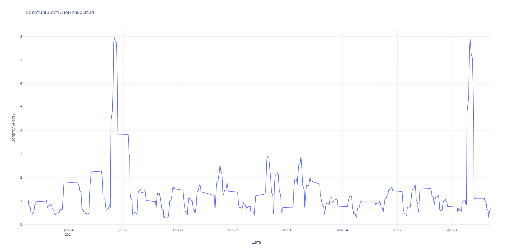
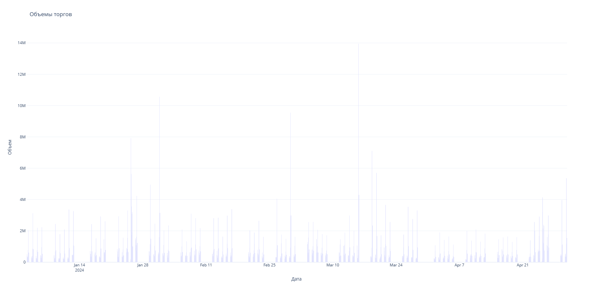

# Stock-analysis-on-the-exchange
## **Описание**
После сбора статистики акций определенной кампании на бирже, алгоритм выдаст рекомендации, когда выгоднее всего покупать и продавать данные акции.
Инструмент может пригодиться как опытным биржевым брокерам, так и пользователям, имеющим минимальный опыт в финансовых операциях.
___

___

___

___

___

___

## **Участники команды:**
Ногуманов Камиль, Бакиев Мурад, Федорова Елена, Гимадов Радик, Шапкина Кристина, Гизатулин Алик
