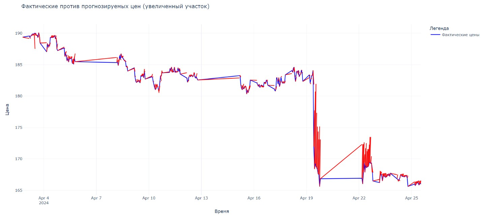

# Stock-analysis-on-the-exchange
## **Описание**
После сбора статистики акций определенной кампании на бирже, алгоритм выдаст рекомендации, когда выгоднее всего покупать и продавать данные акции.
Инструмент может пригодиться как опытным биржевым брокерам, так и пользователям, имеющим минимальный опыт в финансовых операциях.
___

## Цель проекта
Разработка модели, способной предсказывать будущие изменения цен акций на основе исторических данных. 
Это позволит инвесторам и трейдерам принимать более обоснованные решения при покупке, продаже или удержании акций.
___

## Используемые библиотеки:
Scikit-learn, 
Plotly, 
Matplotlib, 
Loguru, 
Catboost, 
Pandas, 
Optuna, 
Numpy, 
Requests, 
Datetime.
___

___

___

## **Участники команды:**
Ногуманов Камиль, Бакиев Мурад, Федорова Елена, Гимадов Радик, Шапкина Кристина, Гизатулин Алик
